# Countdown timer

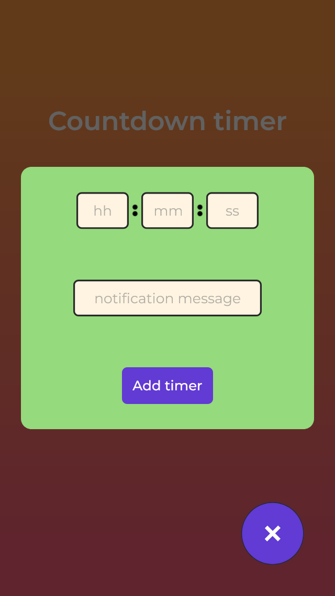

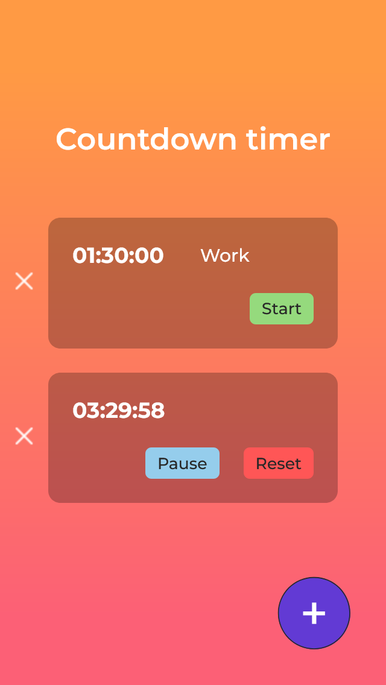

## How works?

The app uses a timer structure to have dynamic form inputs and save the timer time values added by the user.

_src/utils/timerStructure_

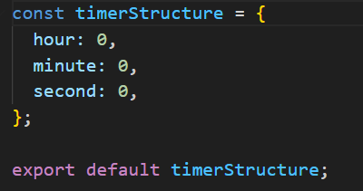

_src/context/index.jsx_

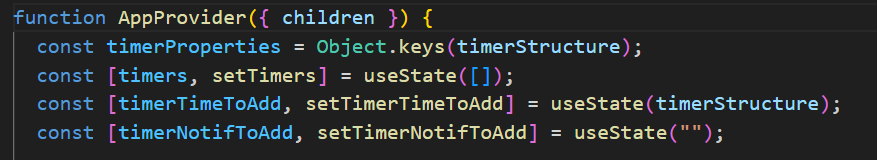

_src/components/TimerFormInputs_

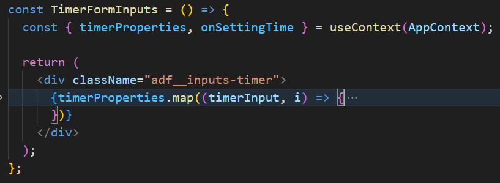

For notification messages works, the browser requests a notification permission and if it's denied or not answered, it will use the alert web api.

_src/context/index.jsx_

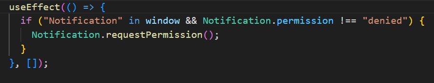

The form input events use a debounce function for not update the state repeatedly.

When the user starts typing in the timer inputs, the onSettingTime function will validate if the entered value is valid to display or clear a form error.

_src/context/index.jsx_

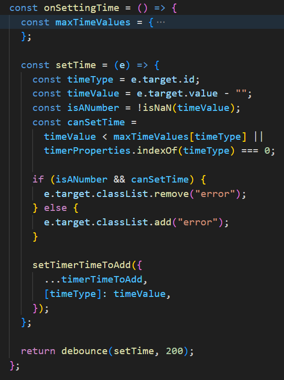

The onSettingNotifMssg function does not require any validation.

_src/context/index.jsx_

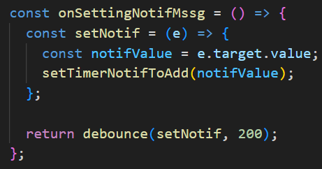

When clicking on the add timer button, the onAddTimer function will validate the time values of the timer, if it's valid, a new timer will be added with the time in seconds, a time format to display to the user and the notification message.

// add

_src/context/index.jsx_

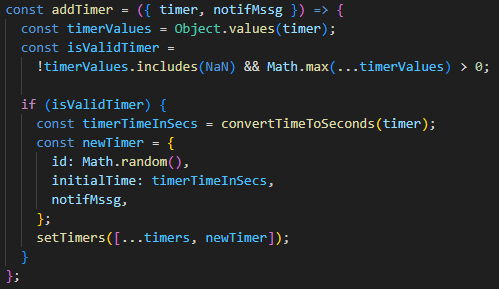

A timer can be deleted by its id.

_src/context/index.jsx_

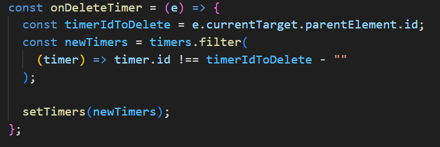

Each timer has its unique state and methods.

_src/components/Timer_

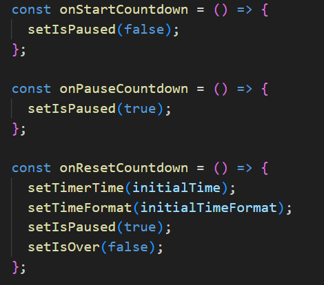

A use effect hook is listening to the changes of the timerTime, isPaused and isOver states to starts a countdown or notify to the user when the timer has expired

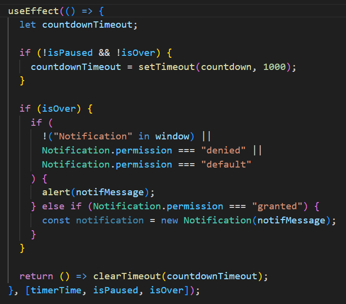

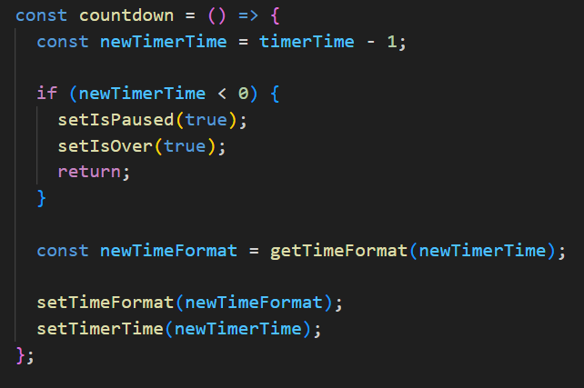
