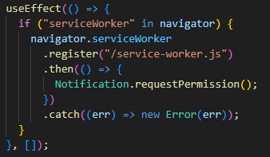
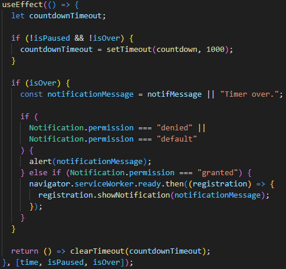

# Countdown timer

The Countdown Timer application allows users to set dynamic timers using a structured form and receive notifications when the timer expires.

## How it works?

The application utilizes a timer structure defined in \_src/utils/timerStructure. This structure allows for dynamic form inputs, enabling users to customize timer durations as needed.

For notification messages to function, the application requests permission from the browser. If permission is denied or not answered, the app resorts to using the alert Web API.

_src/context/index.jsx_

When the user clicks the "Add Timer" button, the onAddTimer function validates the timer's time values. If the values are valid, a new timer is added with the specified time in seconds, and a corresponding notification message.

_src/context/index.jsx_

Timers can be deleted by their respective IDs, providing users with the flexibility to manage their timers.

_src/context/index.jsx_

A useEffect hook is in place to monitor changes in time, isPaused, and isOver states. This hook initiates a countdown or notifies the user when the timer expires.

Feel free to explore, customize, and enhance the application based on your requirements!
